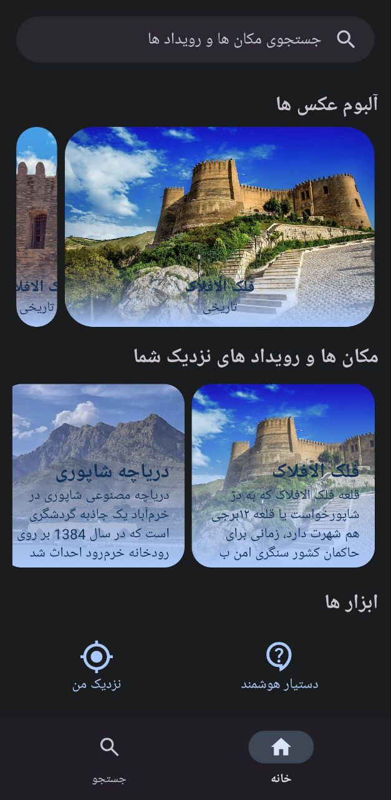
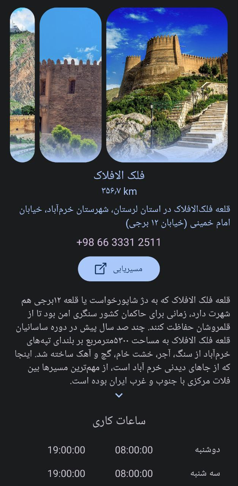
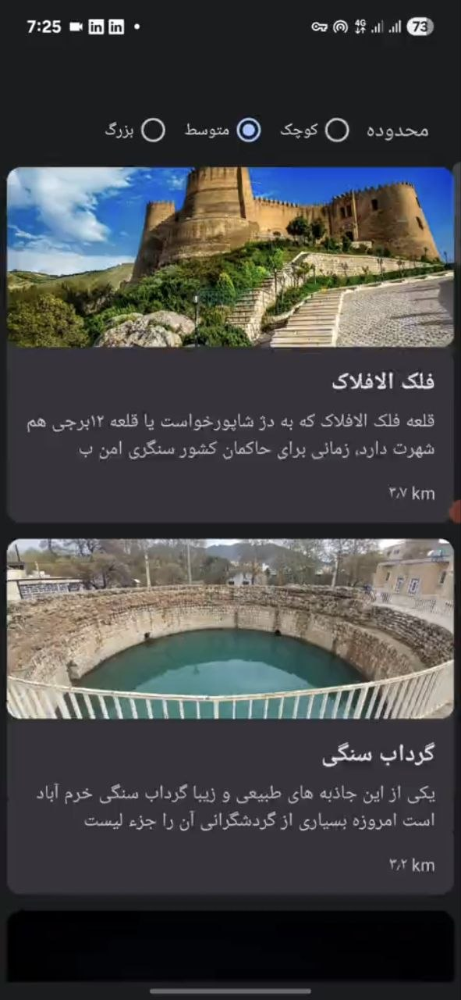
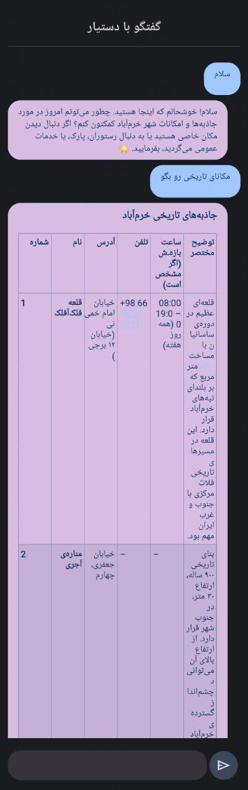

# Lorestan Gardesh  
An Android Tourist Assistant App for Exploring Lorestan Province, Iran

## Overview
**Lorestan Gardesh** is an Android mobile application designed to help tourists easily discover, explore, and navigate points of interest in Lorestan province.  
The app provides rich information about locations, including images, descriptions, contact details, visiting hours, and nearby services such as restaurants and cafés.

This project demonstrates full-stack Android development experience, from UI design and architecture (MVC) to data handling and location-aware features.

---

## Features
- 🔍 **Search** places, events, or attractions
- 🏰 **View detailed information** about historical and natural destinations
- 📸 **Image gallery** for each location
- 📞 **Contact info + Address**
- 🕒 **Working hours**
- 📍 **Nearby services** shown with distance (e.g. restaurants)
- 📐 **Distance estimation** from current location
- ✅ Smooth navigation between list, detail, and search pages
- 🎨 Modern, clean UI with card-based design and rich imagery

---

## Tech Stack & Architecture
- **Language:** Java
- **Architecture:** MVC
- **UI Components:** RecyclerView, CardView, ViewPager, ConstraintLayout, ...
- **Libraries / Tools:**
  - AndroidX
  - Glide for image loading
  - Google Location Services (if enabled)
  - Volley
  - markwon (For markdown text formatting)
- **Data Source:** remote API
- **Dependency Management:** Gradle

---

## Screenshots

| Home | Details | Nearby | Assistant |
|------|---------|--------|-----------|
|  |  |  |  |

---

## 📁 Project Structure (High Level)
```
/app
  ├─ src/main/java/com/…/ui              # Activities / Fragments  
  ├─ src/main/java/com/…/viewmodel       # ViewModel classes  
  ├─ src/main/java/com/…/data             # Models, Repositories, DataSources  
  ├─ src/main/res                        # Layouts, drawables, strings  
  ├─ assets or /res/raw                  # Initial mock data (if used)  
  └─ build.gradle …                      # Dependencies and configuration
```
---

## Skills Demonstrated
- Built a complete multi-page Android app with Java
- Implemented **MVC** architecture
- Consumed structured data for places and categories
- Displayed **lists & dynamic content** using RecyclerView + custom adapters
- Developed **location-based features**
- Implemented detail screens with image galleries & formatted text
- Designed modern UI with Material Design Language
- Optimized performance with efficient image loading and Thread handling
- Handled asynchronous data loading, UI state management, error states and responsiveness for different screen sizes.

## Future Improvements

* Integrate map view with pins/clusters for all attractions.
* Add user authentication and favorite/bookmark functionality.
* Add multilingual support (e.g., English version) and accessibility features.
* Implement offline caching for areas with limited connectivity.
* Add reviewing system for users to be able to rate places.

---
Author: **Sina Khosravi** </br>
GitHub: https://github.com/sina-khosravi-0
